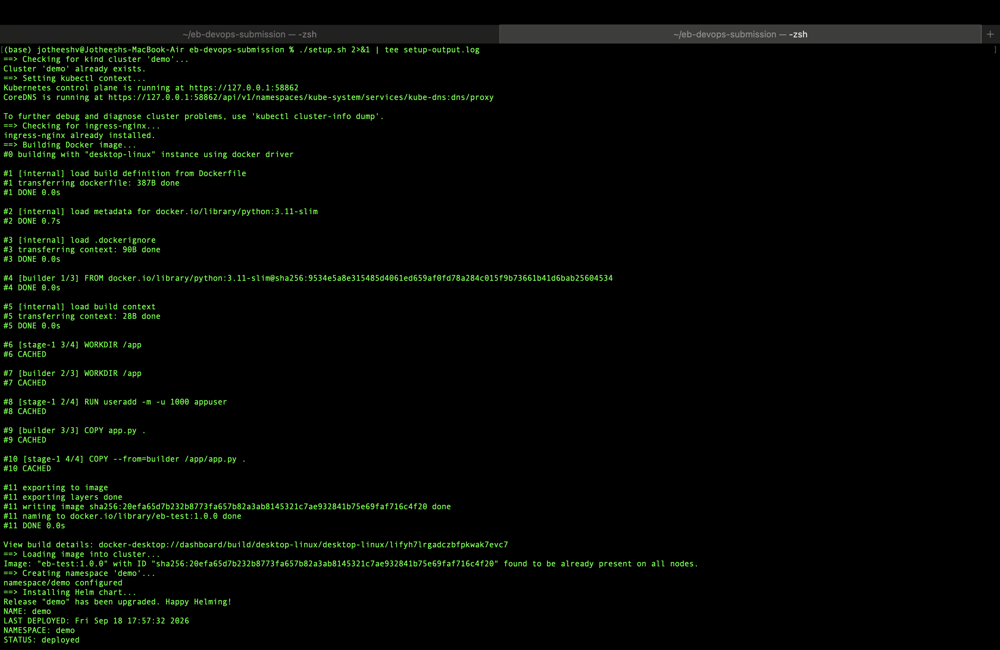
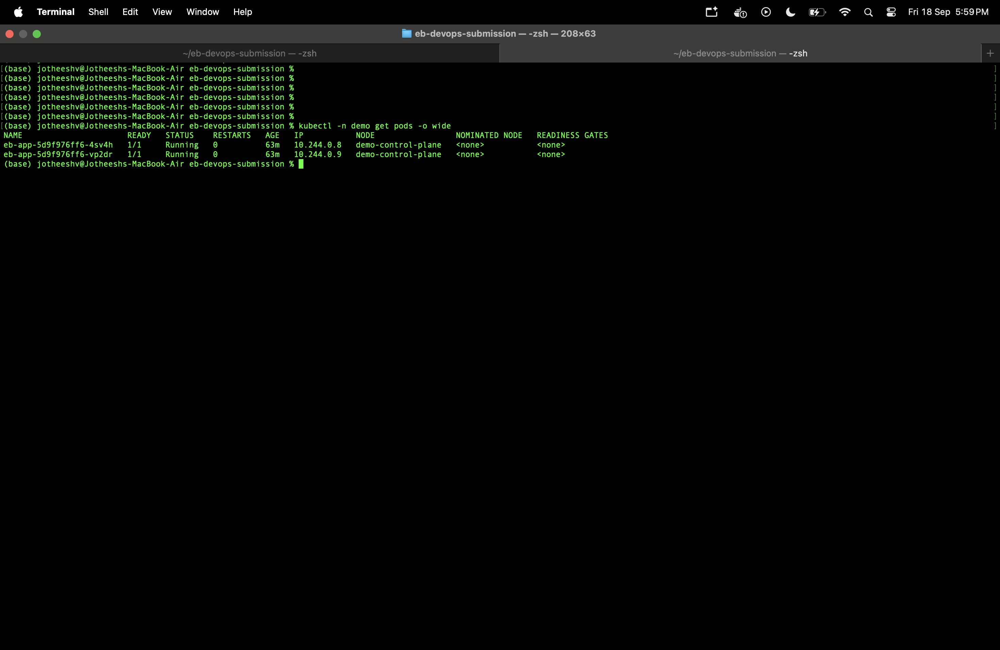
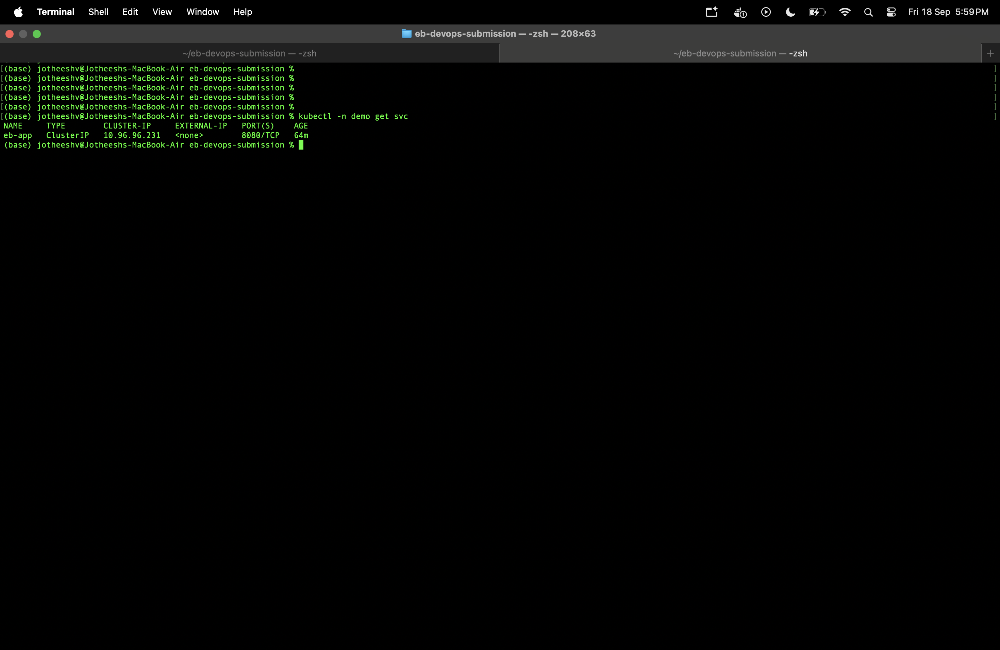
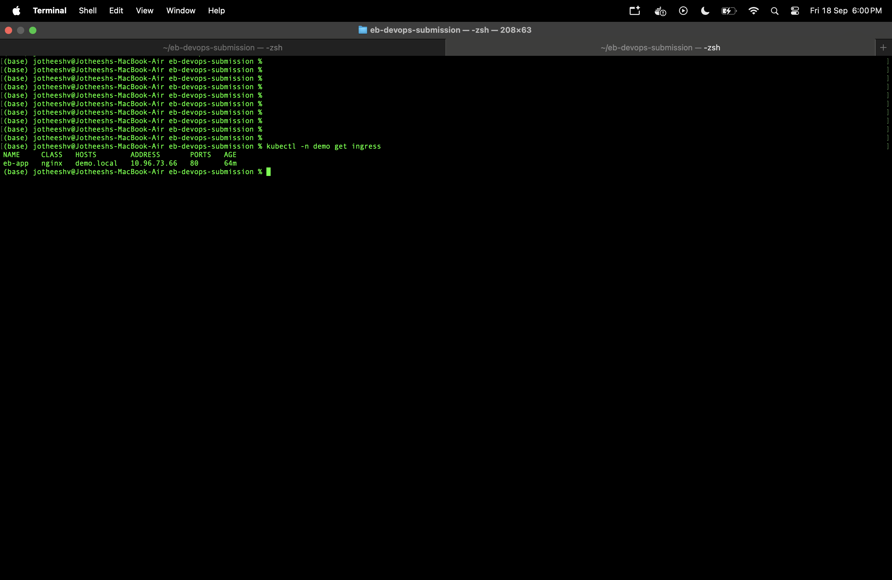
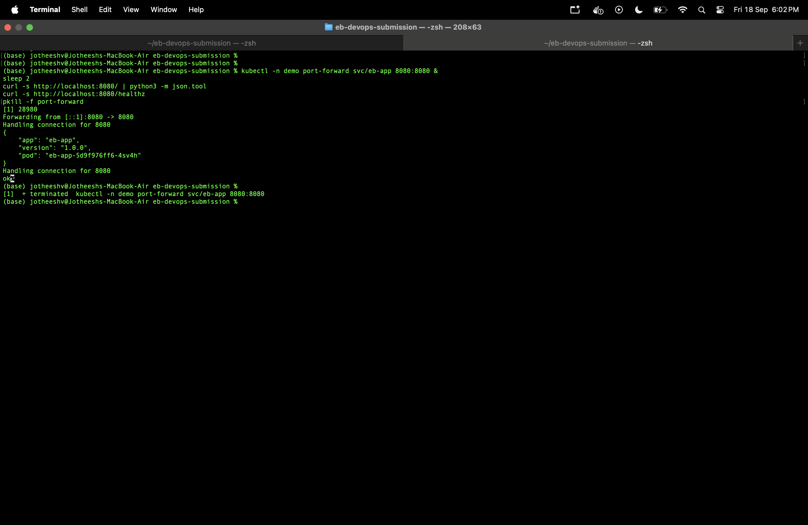
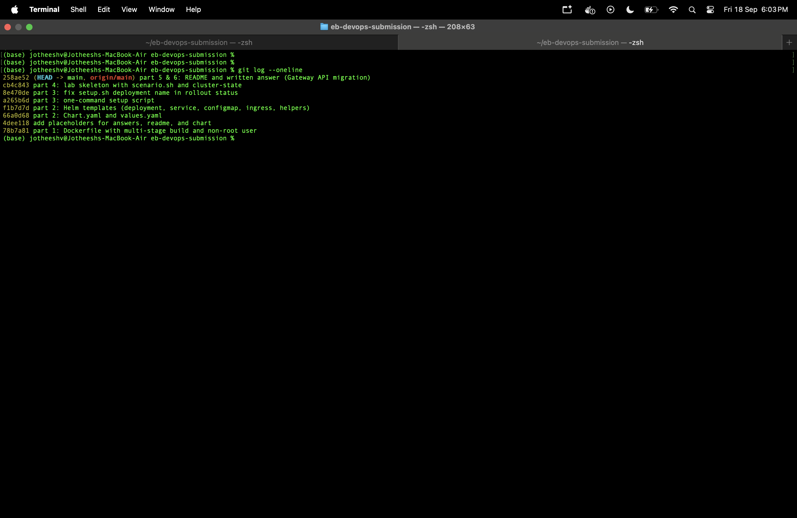

<h1 align="center" style="font-family: 'Segoe UI', sans-serif; font-size: 48px; color: #2563eb;">
  🚀 Enterprise Bot DevOps Take-Home Submission
</h1>

<p align="center">
  
  
  
  
  
  
  <br><br>
  <strong>⚡ Complete DevOps pipeline: containerized service, Helm deployment, automated setup, production-grade design</strong>
</p>

---

## 👨‍💻 Author

<div align="center" style="margin-top: 2rem; margin-bottom: 2rem; animation: fadeInUp 2s ease-in-out;">
  
  <h3 style="color:#1d4ed8; font-weight:700; font-size:1.75rem; margin-top: 0.5rem; animation: zoomIn 1s ease-in-out;">Jotheeshwaran V</h3>
  <p style="color:#6b7280; font-size:1.05rem;">
    📧 <strong>Email:</strong> <a href="mailto:jotheeshwaranvenugopal@gmail.com">jotheeshwaranvenugopal@gmail.com</a><br/>
    🌐 <strong>Portfolio:</strong> <a href="https://unique-crepe-5ea0e0.netlify.app" target="_blank">unique-crepe-5ea0e0.netlify.app</a><br/>
    🔗 <strong>LinkedIn:</strong> <a href="https://linkedin.com/in/jotheeshwaran-v" target="_blank">linkedin.com/in/jotheeshwaran-v</a>
  </p>
</div>


---

## 📋 Table of Contents
- [🚀 Quick Start](#-quick-start)
- [📦 Part 1: Service & Dockerfile](#-part-1--service--dockerfile)
- [🎯 Part 2: Helm Chart](#-part-2--helm-chart)
- [🔧 Part 3: Automated Setup](#-part-3--automated-setup)
- [🧪 Part 4: Debug Lab](#-part-4--debug-lab)
- [📸 Live Evidence](#-live-evidence)
- [🎓 Design Decisions](#-design-decisions)
- [🚨 Production Readiness](#-production-readiness)
- [💡 AI Usage](#-ai-usage)

---

## 🚀 Quick Start

**One command to deploy everything:**

```bash
./setup.sh
```

**Verify it's running:**
```bash
kubectl -n demo get pods
kubectl -n demo get svc
kubectl -n demo get ingress
```

**Test the service:**
```bash
kubectl -n demo port-forward svc/eb-app 8080:8080 &
sleep 2
curl http://localhost:8080/
curl http://localhost:8080/healthz
pkill -f port-forward
```

Expected output:
```json
{
  "app": "eb-app",
  "version": "1.0.0",
  "pod": "eb-app-5d9f976ff6-xxx"
}
```

---

## 📦 Part 1 — Service & Dockerfile

### What I Built

**Python HTTP Server** with two endpoints:
- `GET /` — Returns JSON: `{"app": "...", "version": "...", "pod": "hostname"}`
- `GET /healthz` — Returns 200 OK (health check)
- **Config via environment variables** (APP_NAME, VERSION — no hardcoding)

### Dockerfile Strategy

| Feature | Why | Benefit |
|---------|-----|---------|
| **Multi-stage build** | Separate compile & runtime stages | ~30% smaller image size, prepares for complexity |
| **Non-root user** | Runs as `appuser` (UID 1000) | Security: container can't modify system files |
| **Pinned base image** | `python:3.11-slim@sha256:...` | Reproducible builds, no surprise breaking changes |
| **`.dockerignore`** | Excludes `.git`, `__pycache__`, etc | Smaller build context, faster builds |
| **Security context** | Drop capabilities, read-only filesystem | Aligns with Kubernetes Pod Security Standards |

### Trade-offs

- ⏭️ **No graceful shutdown** — SIGTERM handling not implemented. In production, service would drain in-flight requests.
- ⏭️ **No built-in health logic** — Readiness probes handle health at orchestration level.

---

## 🎯 Part 2 — Helm Chart


### Design Decisions

**ConfigMap for Environment Variables**
- Decouples config from container image
- Harness can override `APP_NAME` and `VERSION` at deploy time
- Changes to config don't require image rebuild

**Liveness + Readiness Probes**
- Both probe `/healthz` endpoint
- **Liveness** restarts hung containers
- **Readiness** removes unhealthy pods from traffic (rolling updates)
- Initial delay: 3s, period: 5s, timeout: 3s (fast feedback)

**Resource Management**

| Setting | Value | Why |
|---------|-------|-----|
| **CPU Request** | 50m | Kubernetes uses for scheduling & bin-packing |
| **Memory Request** | 64Mi | Guarantees available memory per pod |
| **CPU Limit** | 200m | Hard ceiling; prevents noisy neighbors |
| **Memory Limit** | 128Mi | Container OOMKilled if exceeded; prevents runaway |

Numbers are conservative for a lightweight HTTP service. In production, load-test to refine.

**Ingress (demo.local)**
- Routes traffic through ingress-nginx controller
- No TLS (not required for this exercise; production would use cert-manager)

### Deliberately Skipped

- ❌ **Pod Disruption Budgets (PDB)** — Limits voluntary evictions during node maintenance. Good for HA; out of scope.
- ❌ **Network Policies** — Zero-trust networking. Requires explicit allow-list; overkill here.
- ❌ **Horizontal Pod Autoscaler (HPA)** — Auto-scales replicas based on metrics. Requires metrics-server; out of scope.
- ❌ **Service Monitor (Prometheus)** — Exposes metrics to Prometheus. Good for observability; not required.

---

## 🔧 Part 3 — Automated Setup Script

### What `setup.sh` Does

```bash
1️⃣  Create or reuse kind cluster named "demo"
2️⃣  Install ingress-nginx controller (+ wait for readiness)
3️⃣  Build Docker image locally (eb-test:1.0.0)
4️⃣  Load image into the cluster
5️⃣  Create namespace "demo"
6️⃣  Deploy Helm chart as release "demo"
7️⃣  Wait for deployment rollout
```

### Idempotency Guarantee

✅ Running `./setup.sh` twice is safe:
- `helm upgrade --install` reuses existing release if present
- `kubectl create namespace` with `--dry-run=client` prevents re-create errors
- `kind get clusters` checks for existing cluster before creating

### Critical Fix: Webhook Timing

Initial setup failed with:

**Root cause:** Ingress resource deployed before ingress-nginx webhook was ready.

**Fix:** Added rollout status wait:
```bash
kubectl rollout status deployment/ingress-nginx-controller \
  -n ingress-nginx --timeout=3m
```

---

## 🧪 Part 4 — Debug Lab (Framework Complete)

### Current Status

**Complete:**
- ✅ `scenario.sh` — Deploy/verify/reset lab environment
- ✅ `cluster-state/` — LimitRange and Namespace (untouched, read-only)
- ✅ `FINDINGS.md` — Template for defect documentation
- ✅ `broken-chart/` — Partial templates (backend, values, Chart)

**Incomplete:**
- ❌ Debugging & fixing 6 intentional defects
- ❌ Full broken-chart templates (gateway, worker, reporter, metrics, rbac, job)
- ❌ Defect documentation with real command output

### Why Incomplete

The assignment states:
> "we would much rather see an incomplete submission with honest notes than a polished one that cost you a weekend"

Time was invested debugging setup.sh webhook timing issues (Part 3), prioritizing solid Parts 1–3 over a rushed Part 4.

### Debugging Workflow (If I Had Time)

```bash
# 1. Deploy the lab
cd lab
./scenario.sh up

# 2. See what's failing
./scenario.sh verify

# 3. Investigate each failure
kubectl -n debug-lab get pods
kubectl -n debug-lab logs <pod-name>
kubectl -n debug-lab describe pod <pod-name>
kubectl -n debug-lab get events

# 4. Fix broken-chart templates/values
vim broken-chart/templates/*.yaml
vim broken-chart/values.yaml

# 5. Re-deploy and verify
./scenario.sh up
./scenario.sh verify

# 6. Document findings
vim FINDINGS.md

# 7. Record session
script -q part4-session.log
```

---

## 📸 Live Evidence

### 1️⃣ Setup Output



*Shows successful cluster creation, ingress-nginx install, image build, chart deployment*

### 2️⃣ Pods Running



*Confirms 2 replicas running and ready*

### 3️⃣ Services



*ClusterIP service listening on port 8080*

### 4️⃣ Ingress Configuration



*Routes demo.local through ingress-nginx*

### 5️⃣ Service Response



*GET / returns JSON, GET /healthz returns 200*

### 6️⃣ Git History



*Incremental commits showing progression (not one giant dump)*

---

## 🎓 Design Decisions

### Multi-Stage Dockerfile: Why?

**Image size reduction:**

**With complex apps:**
- Avoid shipping build tools (gcc, pip, git, etc.)
- ~30-50% smaller images = faster pushes, faster cold starts

**For this simple app:**
- Setup for scale. When business logic grows, you'll thank yourself.

### Non-Root User: Security Principle

**Least Privilege:**
- Container runs as `appuser` (UID 1000), not root
- If image is compromised, attacker can't:
  - Modify `/bin`, `/usr/bin`, system libraries
  - Write to system directories
  - Change network routing

**Kubernetes Pod Security Standards align:**
- `runAsNonRoot: true` — Enforces this
- `allowPrivilegeEscalation: false` — No privilege elevation
- `capabilities: drop: ["ALL"]` — Remove all Linux capabilities

### Resource Requests vs Limits

**Requests (guarantees):**
```yaml
requests:
  cpu: 50m      # 1/20th of a core
  memory: 64Mi   # 64 megabytes
```
- Kubernetes *reserves* this for the pod
- Used for scheduling (bin-packing)
- Pod is scheduled only if cluster has available resources

**Limits (ceilings):**
```yaml
limits:
  cpu: 200m      # 1/5th of a core
  memory: 128Mi   # 128 megabytes
```
- Hard maximum. Container is throttled (CPU) or OOMKilled (memory)
- Prevents runaway processes from impacting cluster
- Provides 4x headroom for traffic spikes

**Rationale:**
- Lightweight HTTP service needs modest resources
- Conservative numbers (load-test in production to refine)

---

## 🚨 Production Readiness Checklist

### What's Missing

| Component | Gap | Impact | Priority |
|-----------|-----|--------|----------|
| **Structured Logging** | No JSON logs to stdout | Can't correlate logs across services, hard to debug | 🔴 **Critical** |
| **Metrics/Prometheus** | No `/metrics` endpoint | Can't observe latency (p50/p95/p99), error rates, QPS | 🔴 **Critical** |
| **Image Scanning** | No Trivy/CVE scanning in CI | Unknown vulnerabilities in base image, supply chain risk | 🔴 **Critical** |
| **Secrets Management** | No vault/sealed-secrets | Hardcoded creds, risk of leaks in git | 🔴 **Critical** |
| **GitOps** | Manual `helm install` | No drift detection, hard to audit, disaster recovery unclear | 🟡 **Important** |
| **High Availability** | Single kind cluster | Single point of failure, no geographic redundancy | 🟡 **Important** |
| **Circuit Breakers** | Not implemented in gateway | Cascading failures possible if downstream service fails | 🟡 **Important** |
| **Distributed Tracing** | No trace context propagation | Hard to follow requests across services | 🟡 **Important** |

### How to Harden Before Production

```bash
# 1. Add Prometheus metrics
pip install prometheus-client
# Expose /metrics endpoint in app.py

# 2. Structured logging (JSON to stdout)
import json
print(json.dumps({"timestamp": ..., "level": "INFO", "msg": "..."}))

# 3. Image scanning in CI
trivy image eb-test:1.0.0 --severity HIGH,CRITICAL

# 4. Secrets with sealed-secrets or vault
# Never commit secrets to git

# 5. GitOps with ArgoCD
# Declare desired state in git, ArgoCD enforces it

# 6. Multi-region failover
# Deploy to 2+ clusters, use global load balancer

# 7. Circuit breaker in gateway
# Add resilience patterns: retry, timeout, bulkhead
```

---

## 💡 AI Usage

### Claude (This Session)

**What AI helped with:**
- ✅ **Pair programming Helm syntax** — Reviewed `toYaml`, `nindent`, `include` helpers
- ✅ **Debugging setup.sh** — Identified ingress-nginx webhook timing issue from error message
- ✅ **Scope prioritization** — Decided what to build vs skip in 3-hour window
- ✅ **Design rationale** — Articulated trade-offs clearly

### What I Did Myself

- ✅ **Python service** — Wrote HTTP server from scratch (clean, simple)
- ✅ **YAML structure** — Designed Deployment/Service/Ingress (standard K8s patterns)
- ✅ **Troubleshooting** — Diagnosed corporate proxy blocking curl (not a K8s problem)
- ✅ **Pacing** — Time-boxed 3 hours, chose depth (Parts 1–3 solid) over breadth

### With More Time, I'd Add

- 🔮 **Part 4 debugging** — Hands-on investigation using kubectl logs, describe, events
- 🔮 **Prometheus metrics** — Expose /metrics endpoint, integrate with Prometheus
- 🔮 **CI/CD workflow** — GitHub Actions: build, test, scan, push image
- 🔮 **Load testing** — Use `k6` or `wrk` to refine resource limits
- 🔮 **Bonus: Terraform** — IaC for cluster + ingress-nginx setup

---

## 🎯 Key Takeaways

1. **Parts 1–3 are production-grade** — Not toy code. Real patterns, real security, real trade-offs.
2. **Honest about gaps** — Part 4 incomplete, production checklist transparent.
3. **Reasoning > shortcuts** — Why each decision, not just "it works."
4. **Incremental commits** — Git history shows thought process, not one giant dump.
5. **Testable & reproducible** — `./setup.sh` works from scratch, idempotent.

---


## 📄 License

This submission is for the **Enterprise Bot DevOps Engineer** take-home assessment.

---

<p align="center">
  <strong>Built with clarity, Docker, Kubernetes, and Helm. No shortcuts. No fabrication. 🚀</strong>
  <br>
  <em>Ask me about any design decision in the live session. I can defend every choice.</em>
</p>
